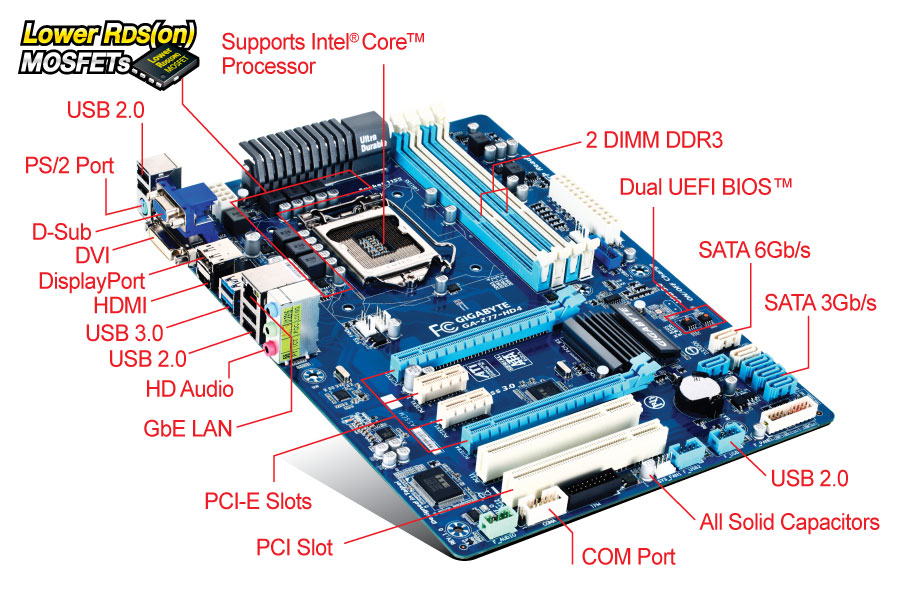
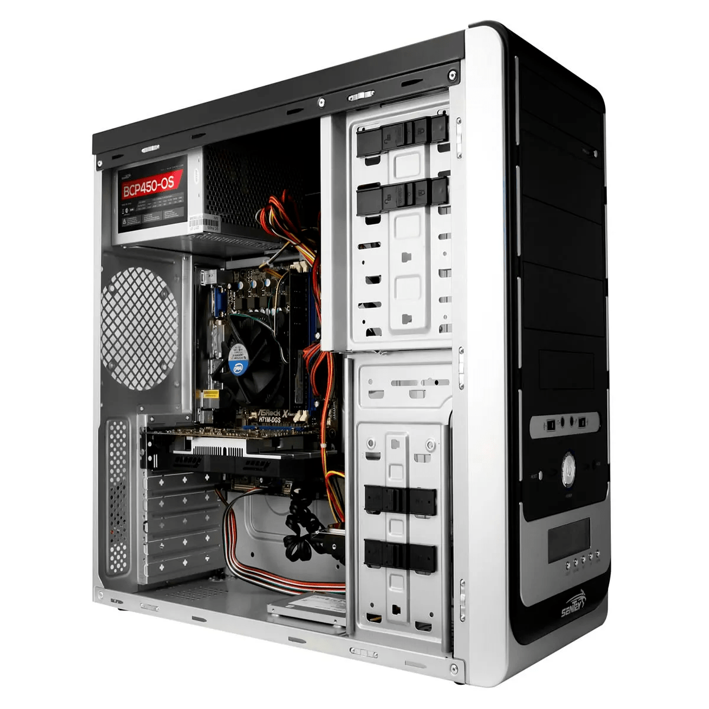
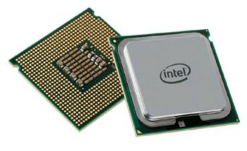
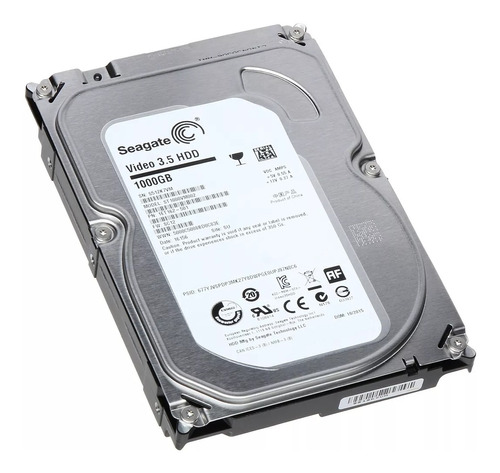
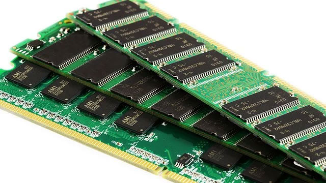
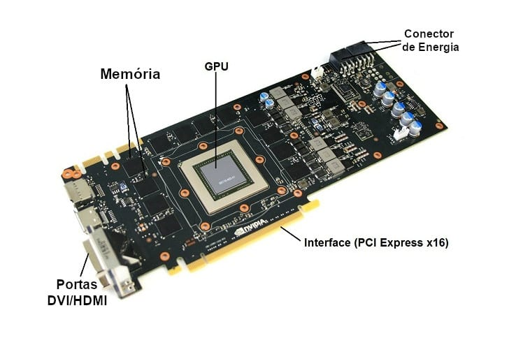

## Hardware

<!-- (Esta seccion hay que mandarla a un anexo o algo asi pero lo dejo para hacer al final, por ahora voy armando todo el contenido, la digramacion de la presentacion es posterior) -->

#### La electronica

Todo lo que estamos acostumbrados a pensar como dispositivos electronicos son en ultima instancia eso, dispositivos que manipulan corrientes electricas (o su contrapartida voltajes) para hacer cosas. Para interactuar con la realidad estos dispositivos suelen tener tres instancias: recibir informacion, procesarla y actuar en consecuencia. 

Para recibir informacion estan los sensores que transforman alguna señal no electrica en electrica y permiten recibir informacion del entorno, ejemplo de esto pueden ser el teclado (que transforma presionar un boton en señales electricas), las pantallas tactiles (que encienden una señal cuando se acerca el dedo a cada zona especifica de la pantalla), o una webcam (que transforma informacion sobre la luz que le llega en una imagen digital). Tambien podrian serlo un termometro, sensores de proximidad, etc. Cualquiera sea el sensor que se utilice traduce un estimulo del mundo cotidiano en señales electricas digitales (voltajes encendidos y apagados o como se suele visualizar: ceros y unos).

Una vez que la informacion esta digitalizada se la puede procesar de maneras muy diversas con muy diversos fines, de eso se encarga la electronica mediante procesadores y microcontroladores.

Por ultimo necesitamos que esa informacion procesada se refleje en algun cambio en el mundo externo. Desde un punto de vista electronico a los dispositivos que se encargan de eso se los suele llamar actuadores. En una computadora ejemplos de actuadores son las pantallas (prender o apagan pequeños leds para formar imagenes en funcion de la corriente que les llegue), las impresoras (que dejan salir tinta o no y mueven con motores hojas para lograr una impresión), un router o antena wifi (donde se generan ondas electromagneticas), o podria serlo en terminos mas generales cualquier tipo de motor controlado mediante electronica, la resistencia electrica que calienta el agua en una pava electrica, etc. 

#### La PC y sus partes

##### Motherboard

Desde un punto de vista funcional, una PC se monta sobre el motherboard. El motherboard o "la mother" es un conjunto de electronica y microcontroladores y cableado (o "bus" de conexion) que permiten la interconexion entre todas las demas partes de una computadora permitiendo que mediante ciertos estandares todas las partes que se conecten puedan comunicarse con las demas. 

##### Los perifericos

Se llama perifericos a todos los componente intercambiables (y no indispensables) que se suelen conectar a una computadora tipica de escritorio. Los mas comunes son: pantallas, teclado, mouse, webcams, impresoras, parlantes, microfonos, etc. Todos estos perifericos tienen que intercambiar informacion con la computadora de alguna manera. Antiguamente las mother tenian conectores especificos para cada tipo de perifericos, con el tiempo se fue pasando a protocolos mas estandarizados de comunicacion que permiten en un mismo puerto (por ejemplo USB, o HDMI) conectar dispositivos muy diversos. Hoy dia muchas veces la conexion se realiza inalambricamente por bluethoot o wifi. En las computadoras portatiles o los modelos all-in-one todos los perifericos (y tambien las demas componentes internos) suelen venir integrados de fabrica y son mas dificiles de reemplazar.

##### El gabinete 

El gabinete es la estructura metalica o plastica tipicamente parelilepipeda donde se alojan todos los elementos que no son perifericos. Dentro del mismo se coloca la mother con todos elementos que se conectan a la misma y suele incluir "la fuente" (que transforma la energia de linea a un voltaje adecuado para cada uno de los componenetes) asi como conectores en la parte delantera y trasera mas comodos y esteticos que los originales de la mother. El gabinete ademas da la estructura solida para que se puedan colocar ventiladores que ayuden a disipar el calor asi como proteger los componenetes de la intemperie. Muchas veces se generalizas y se llama CPU al gabinete y todo lo que dentro del mismo.

##### CPU (Central Proccess Unit)

Como ya mencionamos en una compuadora toda la informacion que se manipula esta codificada en terminos de corrientes y voltajes (cero y unos segun haya voltaje alto o bajo). Todos los componenetes electronicos incluyen microcontroladores que realizan operaciones especificas sobre esas señales, pero las computadoras cuentan con una unidad de procesamiento mucho mas potente que las demas que esta diseñada para realizar operaciones conceptuales arbitrarias comandadas por el software que se este ejecutando. De alguna manera el sofware corre en el procesador y todo lo demas es la infraestructura para que esto pueda suceder. El procesador recibe en cada momento la operacion que debe realizar, lo cual incluye los datos correspondientes a esa instruccion y la instruccion en si misma, por ejemplo sumar y que numeros sumar.

##### Unidad de almacenamiento - Disco Rigido

Si bien muchas veces queremos que la computadora interactue con informacion que proviene del entorno (por ejemplo que cosas hacemos con el teclado o el mouse) hay mucha informacion que queremos guardar en forma permanente dentro de la computadora. Por ejemplo las fotos, documentos que creamos o la propia informacion del codigo del sistema operativo que tiene que permanecer en la computadora cuando la computadora esta apagada para que se pueda volver a ejecutar al encender. Para guardar todo tipo de información las computadoras cuentan con unidades de almacenamiento interno (se suelen llamar disco rigido aunque ya no siempre son fisicamente discos). Dentro de estas unidades la informacion se encuentra estructurada en unidades o discos, en carpetas y en archivos.  

##### Memoria RAM

A diferencia de la informacion que se guarda en el disco rigido cuyo objetivo es permanecer en el tiempo, buena parte de la informacion que se manipula dentro de la computadora es temporal (por ejemplo que secuencia de caracteres escribimos en el teclado, cual es el contenido de la pagina web que estamos mirando, o las textuas que se estan mostrando en el videojuego que tenermos abierto). Esta informacion no tiene que ser almacenada cuando la computadora se apaga (o cuando se cierra el programa que la usa) pero debe estar disponible de manera directa para cuando el procesador reciba la instruccion de procesarla. Para esto las computadoras cuentan con un tipo de memoria especial (que se caracteriza por ser de muy rapido acceso) que se llama RAM (Random Access Memory). La RAM es el lugar donde continuamente el procesador (y los programas que corren en el) estan almacenando la informacion temporal que necesitan para ejecutarse.

##### GPU - Placa de video

Las placas de video (Graphics Proccess Unit) son componentes opcionales que se suelen agregar a las computadoras. Son una especie de mini computadora (incluye un procesador diseñado para optimizar operaciones graficas, RAM y puertos propios de conexion) que esta destinada a uno de los aspectos que en ciertos contextos mas demanda a las computadoras que es generar los graficos (renderizar) de juegos y aplicaciones de diseño. En caso de que una computadora no tenga placa de video agregada, la mother o la CPU suplen esta funcion con peor rendimiento. La importancia conceptual de las GPU es que al incluir potentes procesadores diseñados para operaciones particulares (y no generales como la CPU) algunos codigos de vinculados a la ciencia de datos que son muy intensivos en el uso de procesador se los puede diseñar para que se ejecuten de manera eficiente en una GPU. 

Asi como las GPU tienen procesadores optimizados para operaciones de manipulacion de imagenes hoy dia existen procesadores de diseño especifico que se pueden usar para tareas especificas. Por ejemplo Google diseño TPU, que son procesadores diseñados para ser muy eficientes usando TensoFlow que es un software de manejo de operaciones de IA (Inteligencia Artificial) y redes neuronales.

<!-- 
Aca termina lo que iria a anexo
-->