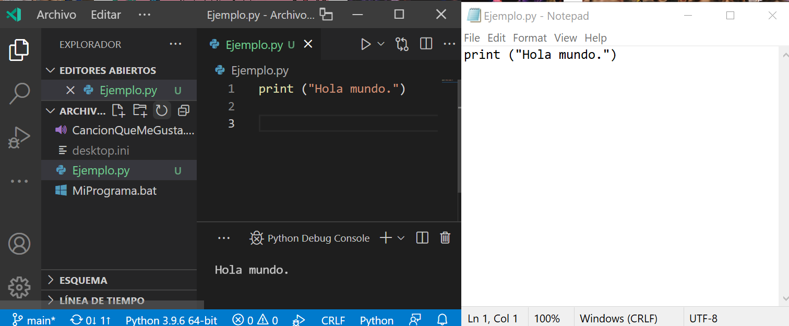
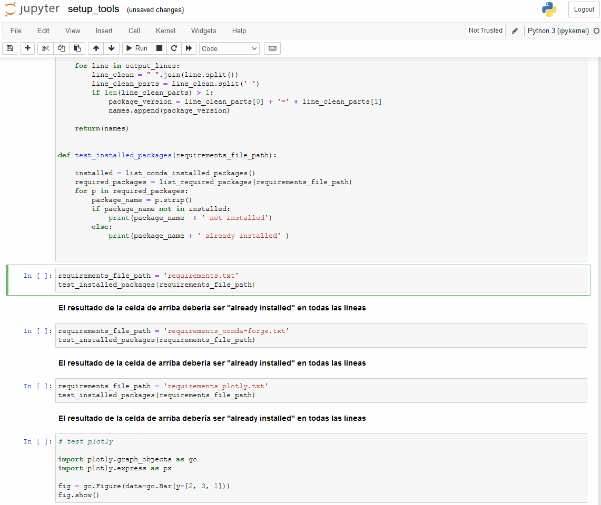
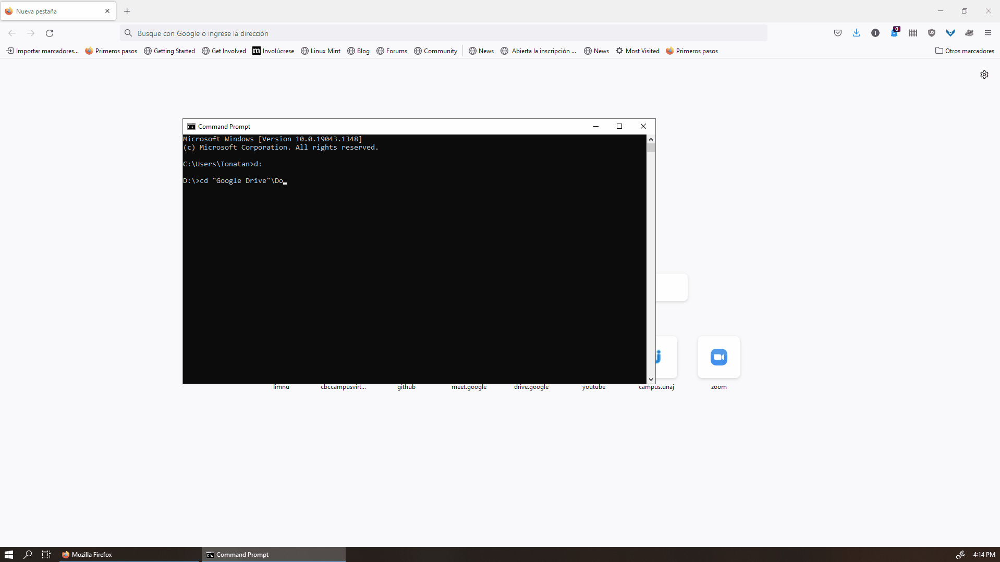

# Entornos de programación

Un código de Python es en última instancia un archivo de texto donde cada línea se lee como una instrucción. Podríamos, si queremos, programar usando el bloc de notas. Sin embargo hay múltiples programas que hacen la experiencia de programar mucho más amigable, ya sea porque entienden la sintaxis y resaltan colores, porque incluyen opciones de autocompletar, de visualizar los archivos que involucran el proyecto entero, porque permiten ver resultados de la ejecución o porque permiten ejecutar paso a paso e ir viendo los valores de las variables. A estos programas se los llama IDE (Integrated Development Environment) y hay muchos. Uno de los más comunes es el Visual Studio Code (VSC).



Pero además de haber programas externos que agregan capas de funcionalidades Python tiene una herramienta que cumple algunas de esta función de manera integrada, se llama ipython. ipython permite desde la misma consola o editor de texto poner etiquetas que agreguen funcionalidad, y permite desde la consola de Python hacer acciones como repetir comandos viejos, etc. En los hechos es común que no utilicemos solo ipython sino que ipython sea una capa más de las funcionalidades integrando hacia abajo al propio Python y hacia arriba el IDE en el que trabajemos. 

## Las notebooks

Una de las funcionalidades más útiles que implementa ipython es la de poder programar en notebooks. Esto no hace referencia a programar en un una máquina portátil tipo laptop, sino a la idea de un bloc de notas de un laboratorio, donde uno va realizando pruebas y guarda registro de cada una de las cosas que fue haciendo para poder compartirla con los demás o para poder reconstruir en proceso y poder comparar diferentes casos. 



Programar con notebooks tiene la gran ventaja de que no hay que volver a ejecutar todo el código cada vez que se cambia algo (por ejemplo queremos probar como cambia un resultado si tomamos dos o tres casos de una muestra) y entonces solo tenemos que reejecutar ese bloque de código. Además podemos generar dos bloques similares y comparar uno y otro sin necesidad de borrar los resultados anteriores. Para completar esta idea de cuaderno de notas, las notebooks de ipython permiten destinar celdas enteras a notas complementarias que vayan explicando cuál es el proceso por el que pasamos al construir nuestro código. 

Como contrapartida usar las notebooks de ipython tiene dos desventajas que inducen a errores comunes. La primera es que al no reejecutar todo el código desde el principio cada vez que probamos algo, podemos estar pisando datos anteriores (o lo opuesto usando datos que quedaron cargados en memoria y no deberían estar). Obviamente esto se soluciona reejecutando todas las celdas de punta a punta y probando que este todo en orden. La segunda desventaja es que si bien para un trabajo tipo científico es cómodo tener segmentado y repetidos los códigos, desde un punto de vista de eficiencia y buenas prácticas de programación conviene tener todo el código ordenado de manera lógica en un mismo bloque consistente. Es la razón por lo que la herramienta no está tan difundida en proyectos más enfocados en desarrollo de software, pero para hacer ciencia de datos es una herramienta muy cómoda.

## Jupyter

Como vimos ipython permite separar los códigos en pequeños bloques, pero sobre eso se puede agregar una funcionalidad más, que es montar el entorno de programación en un servidor web. Esto permite varias cosas interesantes. Primero, que los outputs o resultados que genera cada celda de código puedan visualizarse con todas las herramientas web, es decir, imágenes, formato de texto, botones interactivos, etc. Segundo, que podamos ir construyendo una "página" donde se ve nuestro código intercalado con los resultados que va dando y quede un registro histórico de lo que hicimos en el propio código y no se pierdan los resultados cuando cerramos el entorno de ejecución (porque las notebooks se van guardando como archivo cada vez que ejecutamos algo). Tercero, que podamos compartir los códigos mediante la web haciendo público el servidor donde corremos el notebook (que de manera predeterminada es visible solo en un navegador local) o subiendo los notebooks a sitios como Google Colab o GitHub que tienen su propio servidor de notebooks. 

El programa más difundido en Python para correr un servidor local que nos permita construir y leer estas notebooks se llama Jupyter y tiene una versión más sencilla que es Jupyter notebook y otro modo más completo que es Jupyter lab. Nosotros en el curso vamos a usar Jupyter lab. 

### Como ejecutar Jupyter lab

Para poder ejecutar correctamente Jupyter lab hay dos cosas importantes a considerar, en que enviroment queremos que se ejecute (el enviroment en que se ejecuta Jupyter determina el enviroment en el que corren los códigos de las notebooks) y en que carpeta queremos que se ejecute (Jupyter nos va a mostrar y va a tener acceso a todos los archivos que haya dentro de la carpeta donde lo ejecutamos). Para elegir estas dos cosas vamos a usar una consola de Conda. Puede ser la consola general del sistema operativo si cuando instalamos Conda lo registramos, y sino podemos abrir una consola de Conda.



Lo primero es movernos en la estructura de archivos hasta donde queramos trabajar. En el ejemplo que mostramos elegimos la carpeta "Setup" dentro de la capeta donde descargamos todo el material disponible del curso. Con eso indicamos a Jupyter que carpeta de trabajo vamos a usar. 

Lo segundo es seleccionar el enviroment (o entorno) de python que queremos usar para nuestro proyecto. Si no recuerdan que es esto pueden revisar la sección correspondiente a Conda del tutorial. De manera predeterminada Conda usa el entorno que se denomina 'Base' que es el compartido con todo el sistema operativo. Para cambiar de entorno tenemos que ejecutar 

```
conda activate dhdsblend2021
```

porque 'dhdsblend2021' es el nombre con el que configuramos el entorno que vamos a usar para nuestro curso al instalar Conda. 

Vamos a ver que una vez activado en entorno aparece delante del path en la consola (dhdsblend2021) indicando que cualquier cosa que ejecutemos se va a ejecutar en ese entorno.

A continuación sí estamos listos para correr Jupyter lab escribiendo 
```
jupyter lab
```

Vamos a ver que en la consola empiezan a aparecer output del Jupyter (donde podemos visualizar información de que está haciendo) pero lo más importante es que nos da un link (o directamente lo abre en el navegador predeterminado) de como acceder al servidor vía web para poder usarlo.

Una vez que carga la página podemos ver que estamos en un sitio web que a la izquierda nos muestra el árbol de directorio de la carpeta donde vamos a trabajar (incluyendo los archivos) y a la derecha un espacio para visualizar los archivos que queramos abrir o para crear alguno nuevo. Si hacemos doble clic en 'setup_tool.ipynb' (o en cualquier otro archivo ipynb que son los de notebooks de ipython) podemos visualizar su contenido y volver a ejecutar los códigos ya escritos que están diseñados para testear que tengamos todo bien instalado. 
